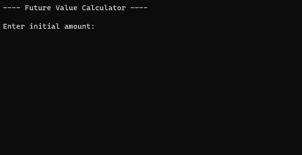

# Winter 2024 Assignment 01 - Arithmetic Expressions
__Weight:__ 5% of final mark

__Submission requirements:__ On or before the deadline, commit a Visual Studio 2022 project to the GitHub repository. __You must commit and push to the classroom repository supplied for the assignment__; do not create your own repository. It is your responsibility to ensure that your work is in the correct repository. ___Work not in the repository will not be graded___.

## Future Value Compounded Monthly
Your friend informed you that their grandmother will be gifting them some money once they graduate from the DMIT program. The amount could be as high as $2,500, depending on how well they do overall in their studies. Your friend knows you are in the CSD concentration, and they have asked you to create a program that will allow them to calculate how much their gift amount will be worth in three to five years if they invest it in a [GIC](https://en.wikipedia.org/wiki/Guaranteed_investment_certificate). You tell them you're currently learning about arithmetic expressions and that you can _easily_ create a short program to help them.

### Requirements
Your program will need to prompt the user for several inputs, namely:

- Initial investment amount: the amount available to invest
- Interest rate: the annual rate of return as a percentage (i.e. 7% would be entered as 7, not 0.07)
- Number of years to invest: the number of years that the initial investment will remain invested (whole numbers only; investments will not be held for half or quarter years).

The program will produce and display the future value amount for the initial investment.

### Formula

__FV = I x (1 + R)T__

Where:  
FV = Future value  
I = Initial investent amount  
R = Monthly interest rate  
T = Number of months to leave invested

So, for example, imagine you have a $1,000 initial investment that will be held for 3 years at 7% interest paid annually. Using the provided formula, you would calculate the future value of your $1,000 as follows:

__FV__ = 1000 x \[1 + (0.07 / 12)](3 x 12) = __$1,232.93__

_NOTE: in the formula above, the interest rate is converted from annual to monthly (divided by 12), and the number of years is converted to the number of months (multiplied by 12)._

### Sample Run

## Submission
Commit and push your solution to your GitHub classroom assignment repository before the deadline. Ensure that your solution follows the best coding and style practices, as your instructor has shown you in class. Failed adherence to the prescribed style guidelines may result in lost marks. __Your program must compile; a program that fails to compile will not be graded.__

_NOTE: push early and often to your repository to recieve feedback from your instructor prior to the deadline. Your instructor will not be providing feedback for every commit every day. However, the eariler and more often you commit, the greater the chances of your instructor reviewing your work and providing constructive feedback that you can act on before the deadline._

## Rubric
| Mark | Description |
|---|---|
| 5  | Excellent – program passes all test cases and coding follows best practices and class standards |
| 4  | Very Good – program passes all test cases, but coding does not follow best practices and class standards |
| 3  | Acceptable – coded most the requirements and program produces the expected results for some of the test cases |
| 2  | Needs Work – coded some the requirements but program fails to produce expected results |
| 1  | Unsatisfactory – code does not meet any of the requirements |
| 0  | Not done |
