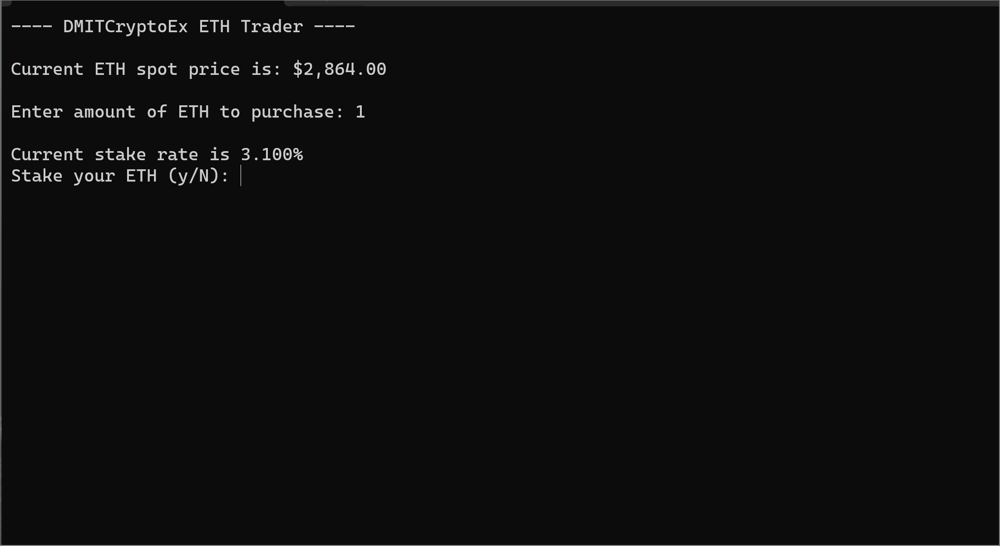
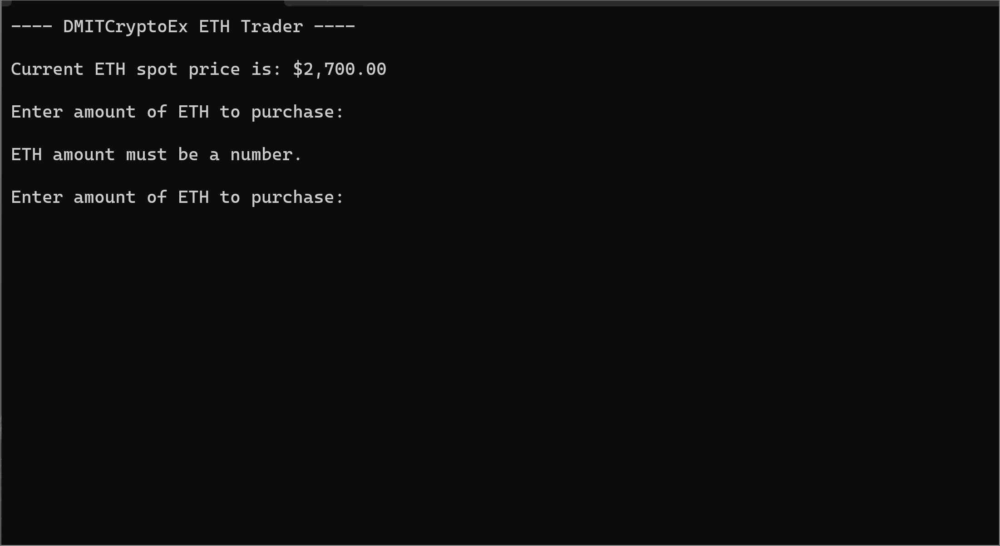

# Winter 2024 Assignment 02 - Control Structures and Error Handling
__Weight:__ 10% of final mark

__Submission requirements:__ On or before the deadline, commit a Visual Studio 2022 project to the GitHub repository. __You must commit and push to the classroom repository supplied for the assignment__; do not create your own repository. It is your responsibility to ensure that your work is in the correct repository. ___Work not in the repository will not be graded___.

## Crypto Trading on DMITCryptEx
_NOTE: you do not have to know anything about cryptocurrency or Ethereum to complete this assignment._

[Cryptocurrency](https://en.wikipedia.org/wiki/Cryptocurrency) (crypto) trading has become more mainstream over the past few years. [Ether](https://ethereum.org/en/) (ETH) is one of the better-known cryptocurrencies, and provides a lower-risk crypto exposure vehicle for new crypto investors. ETH is backed by a lively community and the technology used to support it can be harnessed to develop decentralized applications using the Ethereum network. However, most folks are simply interested in holding the ETH cryptocurrency as an investment that may appreciate or earn rewards from [staking](https://ethereum.org/staking) and [ETH Investment Strategies: Staking vs. Speculation](ETH%20Investment%20Strategies.%20Staking%20vs.%20Speculation.md).

The [centralized exchange](https://www.investopedia.com/tech/what-are-centralized-cryptocurrency-exchanges/) DMITCryptEx would like to explore the option of providing a CLI application for their clients to execute trades. The initial proof-of-concept will allow a client to execute a trade to purchase ETH and ,optionally, to stake their ETH. DMITCryptEx will charge clients a commission fee (varies depending on the amount of ETH they purchase) on all trades and they offer a staking reward rate of 3.1% on all staked ETH.

### Requirements
The program will need to prompt the user for several inputs, namely:

- The fractional amount of ETH the user would like to purchase (must be greater than zero)
- Whether the user would like to stake their ETH or not

The program will need to simulate the spot price for 1.000000 ETH. Generate a random value between $2,600.00 and $2,999.99 to simulate the current ETH price. The simulated price only needs to be generated once during the program's execution. 
_NOTE: For testing purposes, you may set the cost for 1.000000 ETH to a fixed amount. Ensure your final submission makes use of the generated value._

The program will apply a commision (charged by the centralized exchange) to the trade using the following table:

| ETH Purchased | Commission Rate |
|---|---|
| 0.000001 - 0.999999 | 1.9% |
| 1.000000 - 4.999999 | 1.75% |
| 5.000000 - 9.999999 | 1.5% |
| 10.0000 or more | 1.25% |

As you can see, the more ETH a user purchases, the lower the charged commission. If the user chooses to stake their ETH, calculate and display the monthly reward amount. The current annual reward rate offerred by the exchange is 3.1% using [simple interest](https://brilliant.org/wiki/simple-interest/#simple-interest-explained).

The program must display all the calculated results to the user and ask them to confirm their trade. If the user confirms the trade, display a message that confirms the trade. If the user cancels the trade, display a message that the trade has been cancelled.

The program must allow the user to submit multiple trade requests, ending only when the user chooses to end the program. The program must also not crash or abnormally terminate due to any user input or internal processing; display appropriate error messages and recover from any errors gracefully.

### Sample Runs
_NOTE: the repeated trade functionality of your program (i.e. the ability to choose to submit another trade request or to quit) is not shown in the sample runs below. **You will need to develop your own test plan and sample runs for the full program.**_

#### Purchase and confirm

#### Purchase and cancel

#### Purchase, stake, and confirm

#### Exception Handling

## Submission
Commit and push your solution to your GitHub classroom assignment repository before the deadline. Ensure that your solution follows the best coding and style practices, as your instructor has shown you in class. Failed adherence to the prescribed style guidelines may result in lost marks. __Your program must compile; a program that fails to compile will not be graded.__

_NOTE: push early and often to your repository to recieve feedback from your instructor prior to the deadline. Your instructor will not be providing feedback for every commit every day. However, the eariler and more often you commit, the greater the chances of your instructor reviewing your work and providing constructive feedback that you can act on before the deadline._

## Rubric
| Mark | Description |
|---|---|
| 5  | Excellent – program passes all test cases, does not crash for any reason, and coding follows best practices and class standards |
| 4  | Very Good – program passes all test cases, does not crash for any reason, but coding does not follow best practices and class standards |
| 3  | Acceptable – coded most the requirements, does not crash for any reason, and program produces the expected results for most of the test cases |
| 2  | Needs Work – coded some the requirements, the program crashes on invalid user input or internal processing, and the program fails to produce expected results |
| 1  | Unsatisfactory – code does not meet any of the requirements (some code has been submitted, but does not demonstrate the majority of the assessed outcome(s)) |
| 0  | Not done or the program does not compile |
